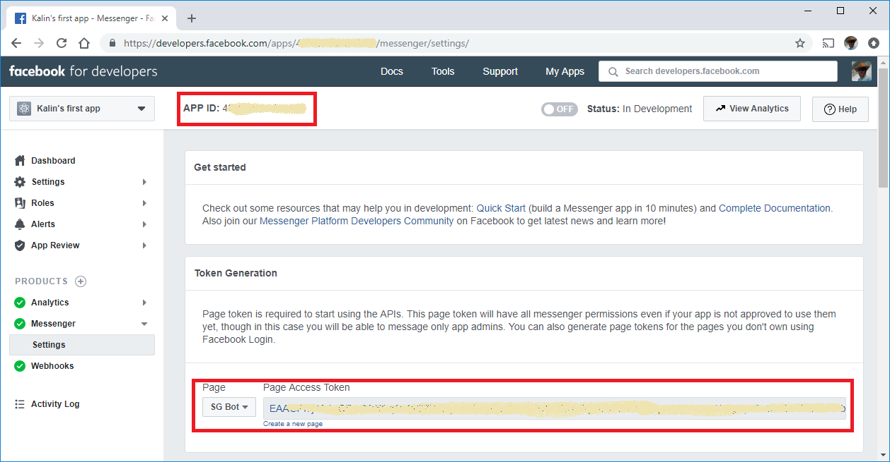
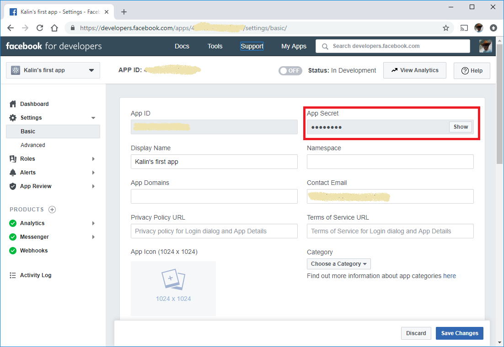
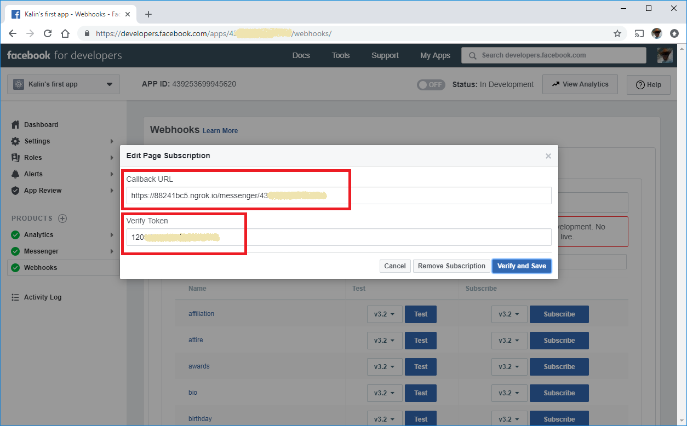

# ut-port-messenger

## Properties

Use the screenshots below to define the following properties:

* Bot properties
  * `appId` - use `APP ID`, highlighted in the screenshot
  * `secret` - use `APP Secret`, highlighted in the screenshot
  * `verifyToken` - use `Verify Token`, highlighted in the   screenshot
* Context properties
  * `clientId` - use `page ID`, highlighted in the screenshot
  * `accessToken` - use `Page Access Token`, highlighted in the   screenshot
  * `name` - use the page name, used to generate the   `Page Access Token`

